# Design Patterns UML Diagrams - WeHack Platform

## 1. Adapter Pattern - Email Services

```plantuml
@startuml Adapter_Pattern_Email
interface MailServiceAdapter {
    +sendMail(organizer: User, recipient: String, subject: String, body: String): void
}

class MailgunAdapter {
    -domain: String
    -apiKey: String
    -baseUrl: String
    -http: HttpClient
    +sendMail(organizer: User, recipient: String, subject: String, body: String): void
    -field(name: String, value: String): String
}

class SpringMailServiceAdapter {
    -mailSender: JavaMailSender
    +sendMail(organizer: User, recipient: String, subject: String, body: String): void
}

class NullMailServiceAdapter {
    +sendMail(organizer: User, recipient: String, subject: String, body: String): void
}

class OrganizerMailAdapter {
    +sendMail(organizer: User, recipient: String, subject: String, body: String): void
}

class SubmissionServiceImpl {
    -mailServiceAdapter: MailServiceAdapter
    +notifyOrganizer(hackathon: Hackathon, organizer: User, recipients: List<String>, subject: String, content: String): void
}

MailServiceAdapter <|.. MailgunAdapter
MailServiceAdapter <|.. SpringMailServiceAdapter
MailServiceAdapter <|.. NullMailServiceAdapter
MailServiceAdapter <|.. OrganizerMailAdapter
SubmissionServiceImpl --> MailServiceAdapter

note right of MailgunAdapter : Adapts Mailgun REST API\nto common interface
note right of SpringMailServiceAdapter : Adapts JavaMailSender SMTP\nto common interface
note right of NullMailServiceAdapter : Null Object Pattern\nDoes nothing
note right of OrganizerMailAdapter : Adapts organizer's SMTP\nto common interface

@enduml
```

## 2. Observer Pattern - Hackathon Notifications

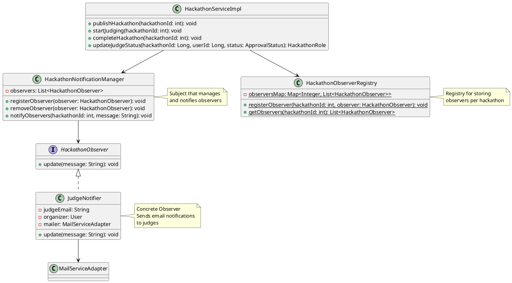

## 3. Decorator Pattern - Notification Services

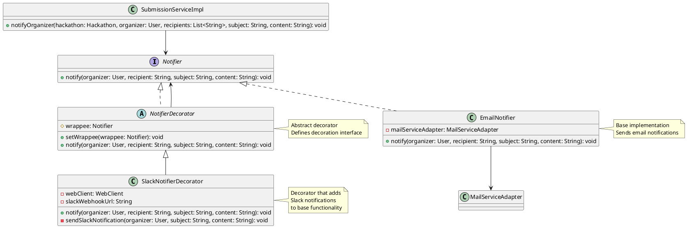

## 4. Builder Pattern - Submission Creation

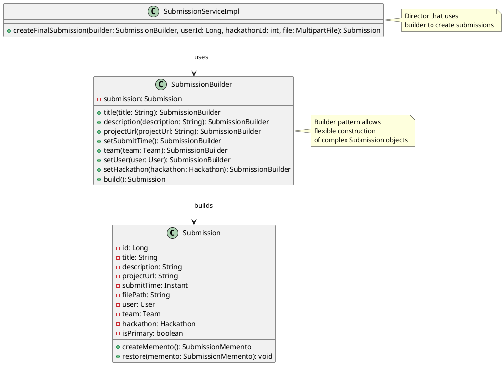

## 5. Memento Pattern - Submission History

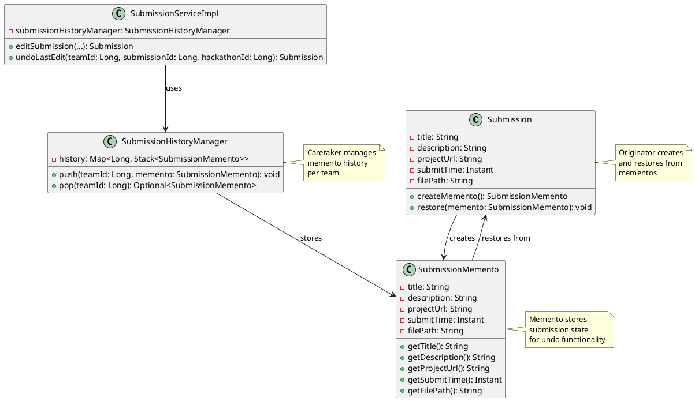

## 6. State Pattern - Hackathon Lifecycle

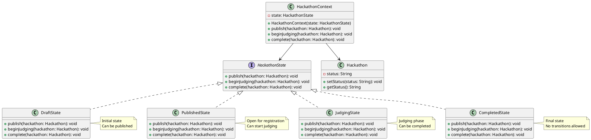

## 7. Iterator Pattern - Collection Processing

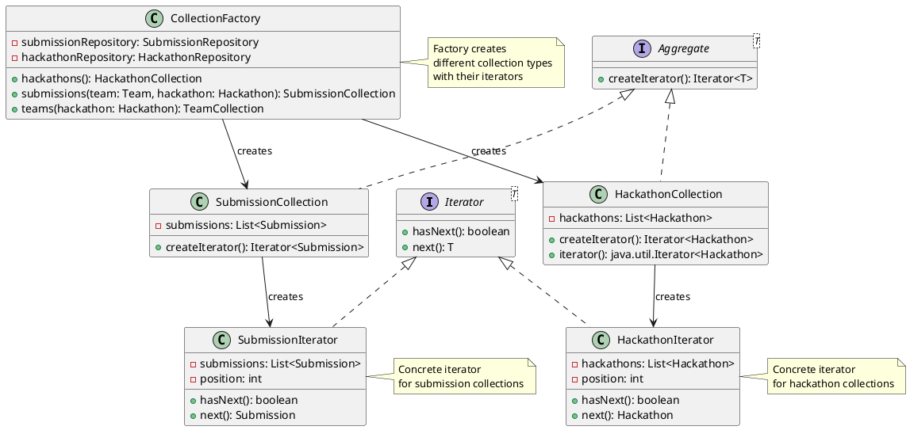

## 8. Factory Pattern - Role Creation

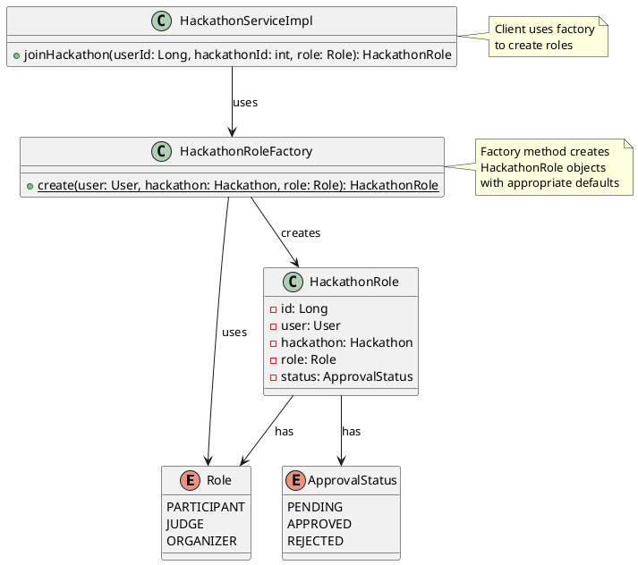

## 9. Template Method Pattern - Scoreboard Generation

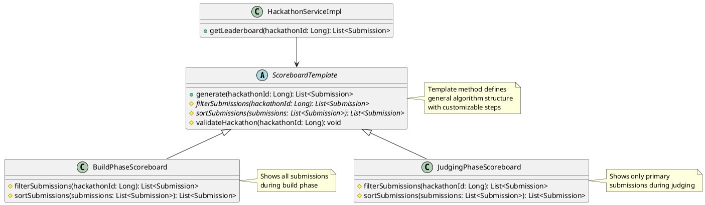

## 10. Strategy Pattern - Email Provider Selection

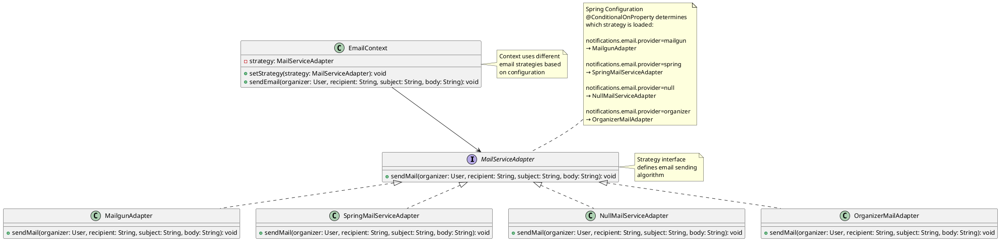

## Pattern Usage Summary

| Pattern | Usage | Classes Involved |
|---------|-------|------------------|
| **Adapter** | Unified email interface | `MailServiceAdapter`, `MailgunAdapter`, `SpringMailServiceAdapter`, `NullMailServiceAdapter` |
| **Observer** | Hackathon notifications | `HackathonObserver`, `JudgeNotifier`, `HackathonNotificationManager` |
| **Decorator** | Enhanced notifications | `Notifier`, `EmailNotifier`, `SlackNotifierDecorator` |
| **Builder** | Submission construction | `SubmissionBuilder`, `Submission` |
| **Memento** | Submission history/undo | `SubmissionMemento`, `SubmissionHistoryManager` |
| **State** | Hackathon lifecycle | `HackathonState`, `DraftState`, `PublishedState`, `JudgingState`, `CompletedState` |
| **Iterator** | Collection traversal | `Iterator`, `HackathonCollection`, `SubmissionCollection` |
| **Factory** | Role object creation | `HackathonRoleFactory`, `HackathonRole` |
| **Template Method** | Scoreboard generation | `ScoreboardTemplate`, `BuildPhaseScoreboard`, `JudgingPhaseScoreboard` |
| **Strategy** | Email provider selection | Dynamic loading via Spring `@ConditionalOnProperty` |
| **Null Object** | No-op email service | `NullMailServiceAdapter` |
| **Proxy** | Validation & security | `SubmissionServiceProxy`, rate limiting, validation chain |
| **Chain of Responsibility** | Submission validation | `SubmissionValidator`, `TitleValidator`, `DescriptionValidator`, `FileSizeValidator` |
| **Visitor** | Analytics collection | `AnalyticsVisitor`, `AnalyticsCollector` |
| **Abstract Factory** | Collection creation | `CollectionFactory` creates different collection types |
| **Repository** | Data access abstraction | `SubmissionRepository`, `HackathonRepository`, `UserRepository` |
| **MVC** | Web architecture | Controllers, Services, Models separation |
| **Dependency Injection** | Spring framework | `@Autowired`, `@Service`, `@Component` annotations |

## Additional Patterns (12-18):

### 12. Proxy Pattern - Validation and Rate Limiting

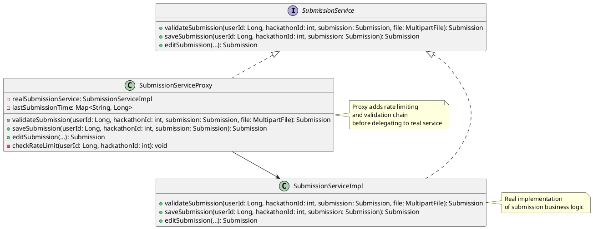

### 13. Chain of Responsibility Pattern - Validation Chain

```plantuml
@startuml Chain_Responsibility_Validation
interface SubmissionValidator {
    +setNext(next: SubmissionValidator): void
    +validate(submission: Submission, file: MultipartFile): void
}

abstract class BaseValidator {
    #next: SubmissionValidator
    +setNext(next: SubmissionValidator): void
    +validate(submission: Submission, file: MultipartFile): void
    #{abstract} doValidate(submission: Submission, file: MultipartFile): void
}

class TitleValidator {
    #doValidate(submission: Submission, file: MultipartFile): void
}

class DescriptionValidator {
    #doValidate(submission: Submission, file: MultipartFile): void
}

class FileSizeValidator {
    #doValidate(submission: Submission, file: MultipartFile): void
}

class SubmissionServiceProxy {
    +validateSubmission(...): Submission
}

SubmissionValidator <|.. BaseValidator
BaseValidator <|-- TitleValidator
BaseValidator <|-- DescriptionValidator
BaseValidator <|-- FileSizeValidator
BaseValidator --> SubmissionValidator
SubmissionServiceProxy --> SubmissionValidator

note right of TitleValidator : Validates title\nrequirements
note right of DescriptionValidator : Validates description\nrequirements
note right of FileSizeValidator : Validates file size\nlimits
note right of BaseValidator : Abstract handler\ndefines chain structure

@enduml
```

### 14. Visitor Pattern - Analytics Collection

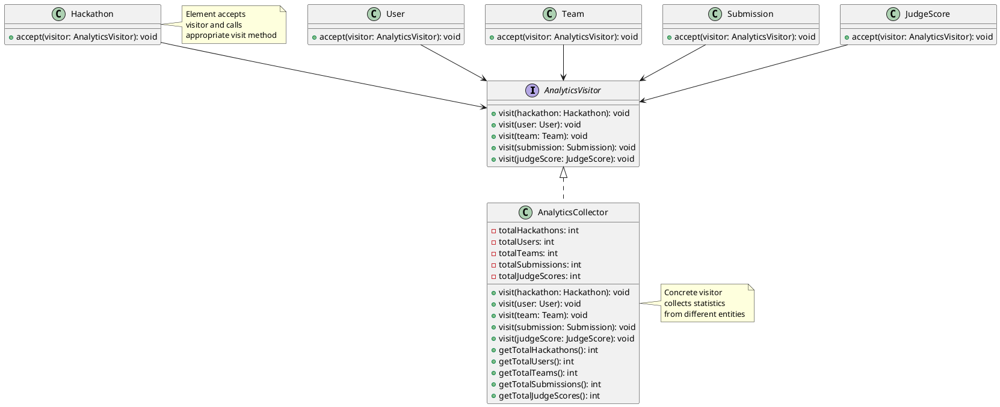

### 15. Abstract Factory Pattern - Collection Factory

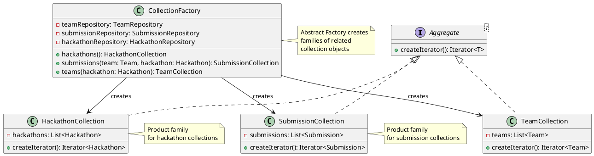

### 16. Repository Pattern - Data Access

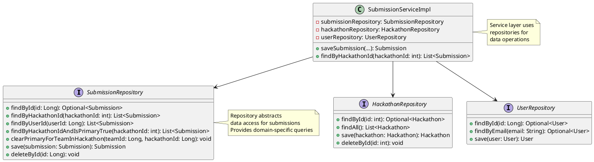

### 17. MVC Pattern - Web Architecture

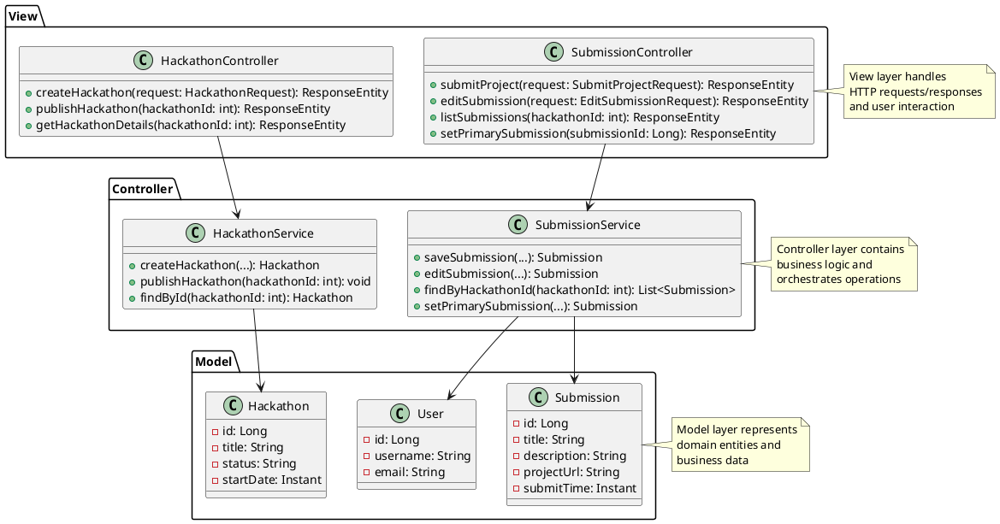

### 18. Dependency Injection Pattern - Spring Framework

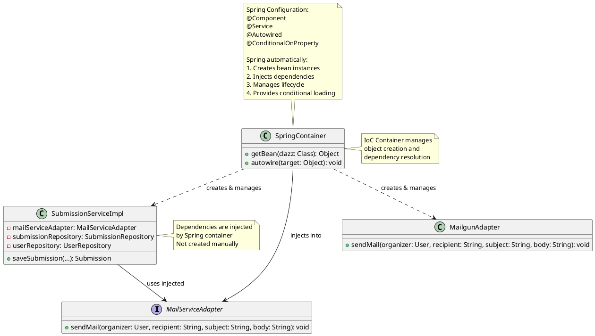

## Complete Pattern Count: 18 Design Patterns ✅

### **Behavioral Patterns (8):**
1. **Observer** - Hackathon notifications
2. **Strategy** - Email provider selection 
3. **Template Method** - Scoreboard generation
4. **Chain of Responsibility** - Validation chain
5. **Memento** - Submission history
6. **Visitor** - Analytics collection
7. **Iterator** - Collection traversal
8. **State** - Hackathon lifecycle

### **Creational Patterns (4):**
9. **Builder** - Submission construction
10. **Factory** - Role creation
11. **Abstract Factory** - Collection factory
12. **Dependency Injection** - Spring IoC

### **Structural Patterns (6):**
13. **Adapter** - Email service unification
14. **Decorator** - Enhanced notifications
15. **Proxy** - Validation & rate limiting
16. **Repository** - Data access abstraction
17. **MVC** - Architectural pattern
18. **Null Object** - No-op implementations
</rewritten_file> 